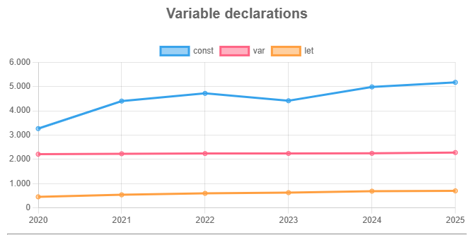

# Explorando evolução de código

Neste exercício, iremos explorar a evolução de código em sistemas reais.

Iremos utilizar a ferramenta [GitEvo](https://github.com/andrehora/gitevo).
Essa ferramenta analisa a evolução de código em repositórios Git nas linguagens Python, JavaScript, TypeScript e Java, e gera relatórios `HTML` como [este](https://andrehora.github.io/gitevo-examples/python/pandas.html).

Mais exemplos de relatórios podem ser podem ser encontrados em https://github.com/andrehora/gitevo-examples.

# Passo 1: Selecionar repositório a ser analisado

Selecione um repositório relevante na linguagem de sua preferência (Python, JavaScript, TypeScript ou Java).
Você pode encontrar projetos interessantes nos links abaixo:

- Python: https://github.com/topics/python?l=python
- JavaScript: https://github.com/topics/javascript?l=javascript
- TypeScript: https://github.com/topics/typescript?l=typescript
- Java: https://github.com/topics/java?l=java

# Passo 2: Instalar e rodar a ferramenta GitEvo

> [!NOTE]
> Antes de instalar a ferramenta, é recomendado criar e ativar um [ambiente virtual Python](https://packaging.python.org/en/latest/guides/installing-using-pip-and-virtual-environments/#create-and-use-virtual-environments).

Instale a ferramenta [GitEvo](https://github.com/andrehora/gitevo) com o comando:

```
$ pip install gitevo
```

Execute a ferramenta no repositório selecionado utilizando o comando abaixo (ajuste conforme a linguagem do repositório).
Substitua `<git_url>` pela URL do repositório que será analisado:

```shell
# Python
$ gitevo -r python <git_url>

# JavaScript
$ gitevo -r javascript <git_url>

# TypeScript
$ gitevo -r typescript <git_url>

# Java
$ gitevo -r java <git_url>
```

Por exemplo, para analisar o projeto Flask escrito em Python:

```
$ gitevo -r python https://github.com/pallets/flask
```

> [!NOTE]
> Essa etapa pode demorar alguns minutos pois o projeto será clonado e analisado localmente.

# Passo 3: Explorar o relatório de evolução de código

Após executar a ferramenta [GitEvo](https://github.com/andrehora/gitevo), é gerado um relatório `HTML` contendo diversos gráficos sobre a evolução do código.

Abra o relatório `HTML` e observe com atenção os gráficos.

# Passo 4: Explicar um gráfico de evolução de código

Selecione um dos gráficos de evolução e explique-o com suas palavras.
Por exemplo, você pode:

- Detalhar a evolução ao longo do tempo
- Detalhar se as curvas estão de acordo com boas práticas
- Explicar grandes alterações nas curvas
- Explorar a documentação do repositório em busca de explicações para grandes alterações
- etc.

Seja criativo!

# Instruções para o exercício

1. Crie um `fork` deste repositório (mais informações sobre forks [aqui](https://docs.github.com/pt/pull-requests/collaborating-with-pull-requests/working-with-forks/fork-a-repo)).
2. Adicione o relatório `HTML` no seu fork.
3. No Moodle, submeta apenas a URL do seu `fork`.

Responda às questões abaixo diretamente neste arquivo `README.md` do seu fork:

1. Repositório selecionado:
   https://github.com/prettier/prettier

2. Gráfico selecionado:
   

3. Explicação:
   Escolhi o gráfico de "Declaração de variáveis" do projeto Prettier, que é uma ferramenta de formatação de código. É possível notar que as variáveis do tipo 'const' tiveram um aumento significativo ao longo do tempo (de 3.268 para 5.176), o que pode indicar indica uma forte preferência dos desenvolvedores do Prettier por declarar variáveis que não serão reatribuídas. Mesmo tendo uma redução de 2022 para 2023, o uso de 'const' ainda é muito predominante em comparação com 'let' e 'var'. Não foram encontradas justificativas na documentação do projeto para essa redução, mas pode ser resultado de refatorações ou mudanças na equipe de desenvolvimento.
   A curva do 'var' permaneceu praticamente constante (de 2.213 para 2.281), com pequenas alterações. Enquanto a variável 'let' apresentou um pequeno crescimento (de 455 para 700), o que pode indicar que, quando uma variável precisa de reatribuição, os desenvolvedores estão escolhendo let ao invés de var.

Ou seja, a evolução das declarações de variáveis no Prettier demonstra que: com a evolução do código, seus desenvolvedores estão adotando boas práticas de programação, priorizando a consistência e o escopo adequado das variáveis. É como se o Prettier estivesse praticando aquilo que ele indica. Já que o uso de 'const' é indicado pela própria comunidade e a ferramenta. A quase estagnação de var é ótima: sinal de que o projeto evita escopo confuso e armadilhas de hoisting. O crescimento pequeno de let reforça que o time usa a ferramenta certa para o problema certo, evitando reatribuições desnecessárias.
